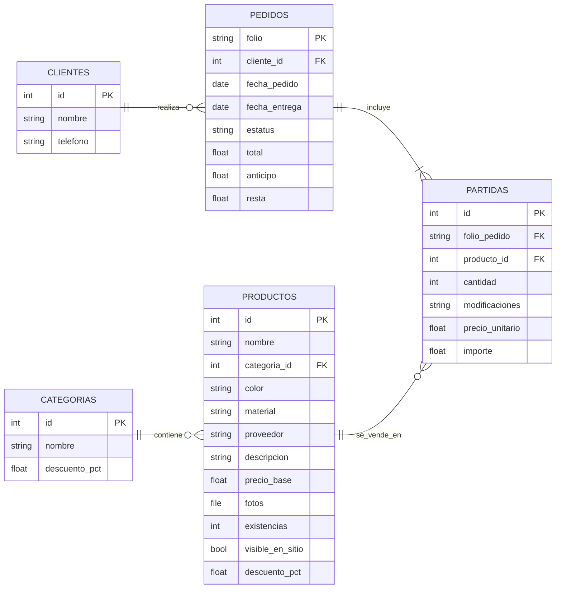

# Modelo de Base de Datos

Este documento contiene el diagrama Entidad-Relación (ER) para el sistema de pedidos y productos.

## Diagrama ER (Horizontal)

## Notas de Implementacióna
* La tabla `PARTIDAS` funciona como la tabla intermedia (muchos a muchos) entre `PEDIDOS` y `PRODUCTOS`

